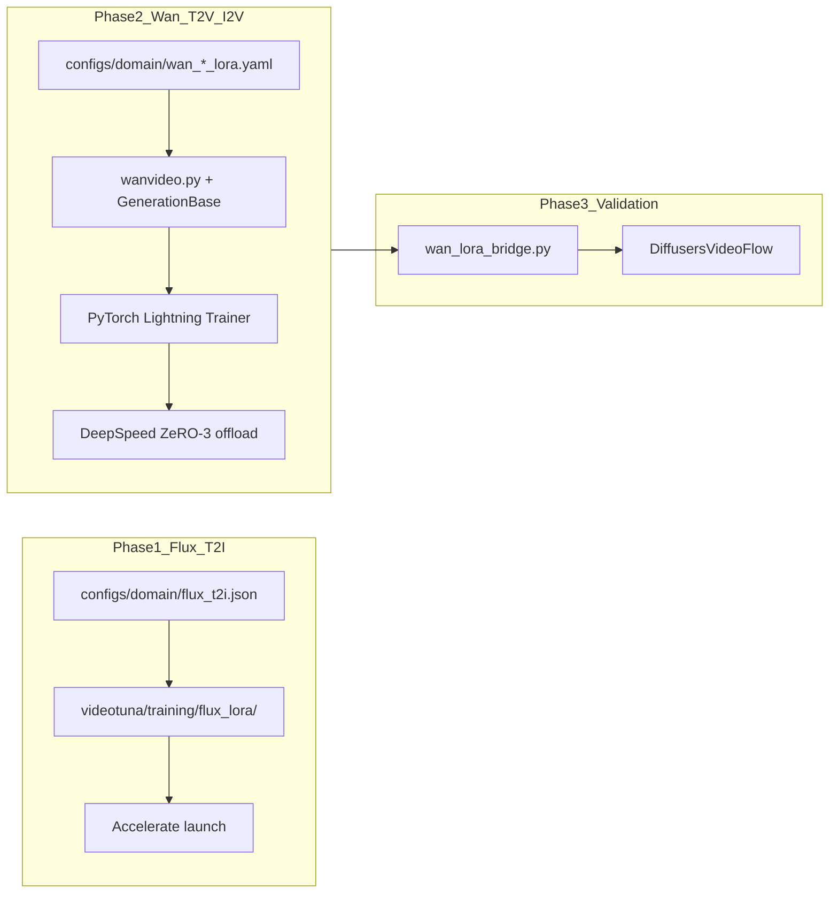

# ADR-001: Dual training stacks (Accelerate vs Lightning+DeepSpeed)

## Status

Accepted

## Date

2026-06-23

## Context

PrivTune is a **training-only** platform with two model families at different scales and upstream ecosystems:

| Phase | Model | Role |
|-------|-------|------|
| 1 — T2I | FLUX.1-dev LoRA | Still-image domain style |
| 2 — T2V / 2.5 — I2V | Wan 2.1 LoRA | Short-video domain motion |

New contributors often see two incompatible training paths and assume technical debt or an incomplete migration. The split is **intentional**.

**Flux T2I** fits the Hugging Face stack end-to-end: Diffusers pipeline, PEFT LoRA, single-GPU training (~24–40 GB VRAM; see [domain-adult-finetune runbook](../runbooks/domain-adult-finetune.md)).

**Wan 2.1 T2V/I2V** uses a [vendored native stack](../../videotuna/models/wan/) without a maintained Diffusers training path for domain LoRA. The 14B video model at 480×832×81 frames needs **DeepSpeed ZeRO-3 CPU offload** to fit on ~38–44 GB GPUs.

**Validation inference** unifies on Diffusers (Wan 2.2) via [`videotuna/utils/wan_lora_bridge.py`](../../videotuna/utils/wan_lora_bridge.py). That bridge is inference-only; it does not replace the native Wan training stack.

## Decision

Keep two training stacks:

| Phase | Stack | Entry point | Code home |
|-------|-------|-------------|-----------|
| Flux T2I LoRA | Hugging Face **Accelerate** | `poetry run train-domain-t2i` | [`videotuna/training/flux_lora/`](../../videotuna/training/flux_lora/) |
| Wan 2.1 T2V / I2V LoRA | **PyTorch Lightning** + **DeepSpeed ZeRO-3** | `poetry run train-domain-t2v` / `train-domain-i2v` | [`scripts/train_new.py`](../../scripts/train_new.py), [`videotuna/flow/wanvideo.py`](../../videotuna/flow/wanvideo.py) |

**Flux on Accelerate** — first-party trainer launched via `accelerate launch` (`scripts/__init__.py` → `videotuna/training/flux_lora/train.py`).

**Wan on Lightning + DeepSpeed** — YAML-driven `GenerationBase.init_trainer()` (`videotuna/base/generation_base.py`), strategy `deepspeed_stage_3_offload` in domain YAMLs (e.g. `configs/domain/wan_t2v_lora.yaml`), DeepSpeed-specific checkpoint export in `videotuna/utils/callbacks.py`.

## Alternatives considered

### Unify both on Accelerate

Wan 14B LoRA still needs ZeRO-3 offload. Reimplementing Lightning callbacks, DeepSpeed checkpoint gather (`zero_to_fp32`), and PEFT dtype mitigations (`autocast_adapter_dtype=False` in `generation_base.py` and `wan_training.py`) on raw Accelerate is high risk for little gain.

**Rejected.**

### Unify both on Lightning

Flux LoRA is a small, Diffusers-native loop. Forcing Lightning adds dependency surface and diverges from Hugging Face training examples without solving a Flux problem.

**Rejected.**

### Train Wan via Diffusers

Wan 2.2 Diffusers is the **validation** target, not the 2.1 training stack. Domain training must stay on native 2.1 weights and checkpoint layout until/unless a first-party Diffusers trainer is built and bridge coverage is re-proven (≥ 90% remap in `tests/test_wan_lora_bridge.py`).

**Rejected** for current scope.

## Consequences

### Install and dependencies

- Wan training requires `poetry install -E cuda --with training` (pulls `deepspeed==0.19.2`, `pytorch-lightning==2.4.0`) and `poetry run install-deepspeed` after torch install.
- Flux only needs `accelerate` from main deps; no DeepSpeed or Lightning in the Flux code path.

### Contributor routing

| If you are changing… | Touch |
|---------------------|-------|
| Flux LoRA loss, checkpoints, data | `videotuna/training/flux_lora/` |
| Wan training loop, callbacks, ZeRO | `generation_base.py`, `callbacks.py`, `wan_training.py`, domain YAMLs |
| Wan ↔ 2.2 validation | `wan_lora_bridge.py`, Diffusers presets |

### Governance

- **Do not** refactor one phase to match the other's stack without superseding this ADR.
- Version pins and breaking-change notes stay in [MODEL_VERSIONS.md](../MODEL_VERSIONS.md); upgrade evaluation outcome in [ADR-002](0002-wan-training-stack-version-pins.md).

## Related docs

- [MODEL_VERSIONS.md](../MODEL_VERSIONS.md) — stack pins and upgrade audit
- [ADR-002: Wan training stack version pins](0002-wan-training-stack-version-pins.md) — DeepSpeed / Lightning pin evaluation
- [vendor-policy.md](../vendor-policy.md) — vendored Wan vs first-party Flux layout
- [domain-adult-finetune.md](../runbooks/domain-adult-finetune.md) — VRAM and training runbook
